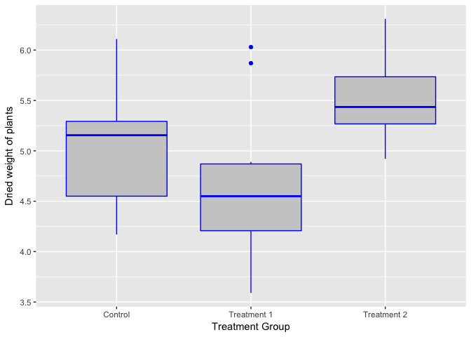

# ANOVA_in_R
Ruijuan Li  
7/25/2017  

# 07-25-2017 

## ANOVA in R 

Analysis of Variance (ANOVA) is a commonly used statistical technique for investigating data by comparing the means of subsets of the data. The base case is the one-way ANOVA which is an extension of two-sample t test for independent groups covering situations where there are more than two groups being compared.

In one-way ANOVA the data is sub-divided into groups based on a single classification factor and the standard terminology used to describe the set of factor levels is treatment even though this might not always have meaning for the particular application. There is variation in the measurements taken on the individual components of the data set and ANOVA investigates whether this variation can be explained by the grouping introduced by the classification factor.

As an example we consider one of the data sets available with R relating to an experiment into plant growth. The purpose of the experiment was to compare the yields on the plants for a control group and two treatments of interest. The response variable was a measurement taken on the dried weight of the plants.

The first step in the investigation is to take a copy of the data frame so that we can make some adjustments as necessary while leaving the original data alone. We use the factor function to re-define the labels of the group variables that will appear in the output and graphs: 


```r
plant.df = PlantGrowth
colnames(plant.df)
```

```
## [1] "weight" "group"
```

```r
summary(plant.df)
```

```
##      weight       group   
##  Min.   :3.590   ctrl:10  
##  1st Qu.:4.550   trt1:10  
##  Median :5.155   trt2:10  
##  Mean   :5.073            
##  3rd Qu.:5.530            
##  Max.   :6.310
```

```r
plant.df$group = factor(plant.df$group,
  labels = c("Control", "Treatment 1", "Treatment 2"))
summary(plant.df) 
```

```
##      weight              group   
##  Min.   :3.590   Control    :10  
##  1st Qu.:4.550   Treatment 1:10  
##  Median :5.155   Treatment 2:10  
##  Mean   :5.073                   
##  3rd Qu.:5.530                   
##  Max.   :6.310
```

The labels argument is a list of names corresponding to the levels of the group factor variable.

A boxplot of the distributions of the dried weights for the three competing groups is created using the ggplot package:


```r
require(ggplot2)
```

```
## Loading required package: ggplot2
```

```
## Warning: package 'ggplot2' was built under R version 3.2.5
```

```r
ggplot(plant.df, aes(x = group, y = weight)) +
  geom_boxplot(fill = "grey80", colour = "blue") +
  scale_x_discrete() + xlab("Treatment Group") +
  ylab("Dried weight of plants")
```

<!-- -->

The geom_boxplot() option is used to specify background and outline colours for the boxes. The axis labels are created with the xlab() and ylab() options. 

Initial inspection of the data suggests that there are differences in the dried weight for the two treatments but it is not so clear cut to determine whether the treatments are different to the control group. To investigate these differences we fit the one-way ANOVA model using the lm function and look at the parameter estimates and standard errors for the treatment effects. The function call is:


```r
plant.mod1 = lm(weight ~ group, data = plant.df)
plant.mod2 = aov(weight ~ group, data = plant.df)
```

We save the model fitted to the data in an object so that we can undertake various actions to study the goodness of the fit to the data and other model assumptions. The standard summary of a lm object is used to produce the following output:


```r
summary(plant.mod1)
```

```
## 
## Call:
## lm(formula = weight ~ group, data = plant.df)
## 
## Residuals:
##     Min      1Q  Median      3Q     Max 
## -1.0710 -0.4180 -0.0060  0.2627  1.3690 
## 
## Coefficients:
##                  Estimate Std. Error t value Pr(>|t|)    
## (Intercept)        5.0320     0.1971  25.527   <2e-16 ***
## groupTreatment 1  -0.3710     0.2788  -1.331   0.1944    
## groupTreatment 2   0.4940     0.2788   1.772   0.0877 .  
## ---
## Signif. codes:  0 '***' 0.001 '**' 0.01 '*' 0.05 '.' 0.1 ' ' 1
## 
## Residual standard error: 0.6234 on 27 degrees of freedom
## Multiple R-squared:  0.2641,	Adjusted R-squared:  0.2096 
## F-statistic: 4.846 on 2 and 27 DF,  p-value: 0.01591
```

```r
plant.mod2
```

```
## Call:
##    aov(formula = weight ~ group, data = plant.df)
## 
## Terms:
##                    group Residuals
## Sum of Squares   3.76634  10.49209
## Deg. of Freedom        2        27
## 
## Residual standard error: 0.6233746
## Estimated effects may be unbalanced
```

The model output indicates some evidence of a difference in the average growth for the 2nd treatment compared to the control group. An analysis of variance table for this model can be produced via the anova command:


```r
anova(plant.mod1)
```

```
## Analysis of Variance Table
## 
## Response: weight
##           Df  Sum Sq Mean Sq F value  Pr(>F)  
## group      2  3.7663  1.8832  4.8461 0.01591 *
## Residuals 27 10.4921  0.3886                  
## ---
## Signif. codes:  0 '***' 0.001 '**' 0.01 '*' 0.05 '.' 0.1 ' ' 1
```

```r
summary(plant.mod2) 
```

```
##             Df Sum Sq Mean Sq F value Pr(>F)  
## group        2  3.766  1.8832   4.846 0.0159 *
## Residuals   27 10.492  0.3886                 
## ---
## Signif. codes:  0 '***' 0.001 '**' 0.01 '*' 0.05 '.' 0.1 ' ' 1
```

## GWAS
https://www.ncbi.nlm.nih.gov/pmc/articles/PMC4547377/pdf/jbr-29-04-285.pdf

single SNP scan for case-control is using Cochran-Armitage trend test
for quantitative trait, using linear regression, analysis of variance, and t-test 

## post-hoc 

So far we have conducted a simple one-way anova. In this instance we see that there is a significant effect of treatment. However, there are 2 treatments. We would like to know which of these treatments are significantly different from the controls and from other treatments. We need a post-hoc test. R provides a simple function to carry out the Tukey HSD test.


```r
TukeyHSD(plant.mod2) # no applicable method for 'TukeyHSD' applied to an object of class "lm" 
```

```
##   Tukey multiple comparisons of means
##     95% family-wise confidence level
## 
## Fit: aov(formula = weight ~ group, data = plant.df)
## 
## $group
##                           diff        lwr       upr     p adj
## Treatment 1-Control     -0.371 -1.0622161 0.3202161 0.3908711
## Treatment 2-Control      0.494 -0.1972161 1.1852161 0.1979960
## Treatment 2-Treatment 1  0.865  0.1737839 1.5562161 0.0120064
```

The table/output shows us the difference between pairs, the 95% confidence interval(s) and the p-value of the pairwise comparisons. All we need to know!

## ANOVA models

So far we have only cinsidered a simple one-way analysis. However, you will often have a more complex situation with several factors. The interaction between factors may also be important. Fortunately R has a model syntax that works for many sorts of analysis. Look at the section on Linear Regression Models for examples. When conducting an anova we have a single dependent variable and a number of explanatory factors.

We set-up our anova in a general way: dependent ~ explanatory1... explanatory2...

The model can take a variety of forms:


