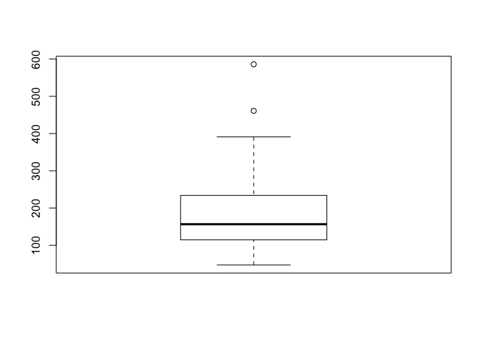
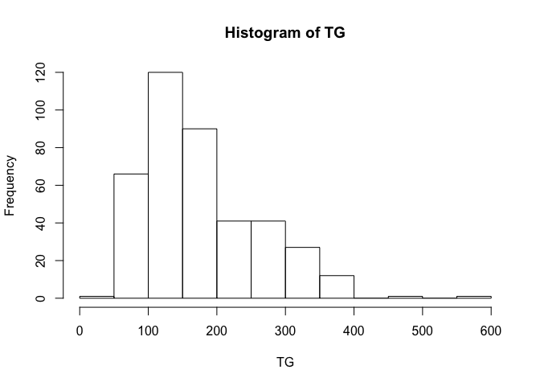
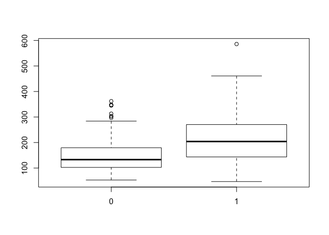
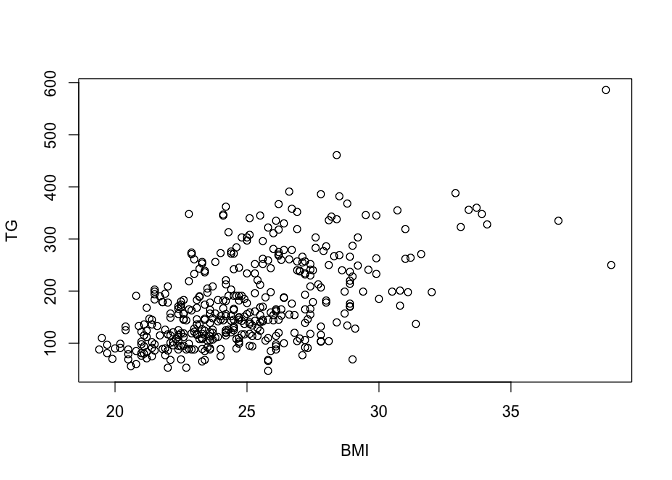

# linear_regression-shrinkage_estimation
Ruijuan Li  
7/27/2017  

# linear regression 

```r
# install all the required packages 
# install.packages("gee")
# install.packages("multcomp")
library(gee)
library(multcomp)
```

```
## Warning: package 'multcomp' was built under R version 3.2.5
```

```
## Loading required package: mvtnorm
```

```
## Warning: package 'mvtnorm' was built under R version 3.2.5
```

```
## Loading required package: survival
```

```
## Warning: package 'survival' was built under R version 3.2.5
```

```
## Loading required package: TH.data
```

```
## Warning: package 'TH.data' was built under R version 3.2.5
```

```
## Loading required package: MASS
```

```
## 
## Attaching package: 'TH.data'
```

```
## The following object is masked from 'package:MASS':
## 
##     geyser
```

# lab1, association between triglycerides & BMI??? 
https://github.com/leejimmy93/summer_institute/blob/master/module_4_regression_and_ANOVA/2016_SISG_4_2.pdf (slides 1-58)

```r
cholesterol = read.table("http://faculty.washington.edu/rhubb/sisg/SISG-Data-cholesterol.txt", header=T)
attach(cholesterol) # make variables global available in R studio 
# compute univariate summary statistics for triglycerides
dim(cholesterol) # 400 
```

```
## [1] 400   9
```

```r
# take a look at the data 
mean(TG)
```

```
## [1] 177.44
```

```r
median(TG)
```

```
## [1] 156.5
```

```r
sd(TG)
```

```
## [1] 82.98323
```

```r
summary(TG)
```

```
##    Min. 1st Qu.  Median    Mean 3rd Qu.    Max. 
##    47.0   114.8   156.5   177.4   234.0   586.0
```

```r
# graphical displays for triglycerides
boxplot(TG)
```

<!-- -->

```r
stem(TG) # ??? similar to histogram, but in a numeric pattern 
```

```
## 
##   The decimal point is 2 digit(s) to the right of the |
## 
##   0 | 
##   0 | 5556677777777778888888888999999999999999999999999999999
##   1 | 00000000000000000000011111111111111111111111122222222222222222222222+34
##   1 | 55555555555555555555555555666666666666666666677777777777777777778888+18
##   2 | 00000000000001111111112222333333334444444444444
##   2 | 5555555566666666666667777777777778888888899
##   3 | 0000001112222233444444
##   3 | 5555555566666778999
##   4 | 
##   4 | 6
##   5 | 
##   5 | 9
```

```r
?stem
hist(TG)
```

<!-- -->

```r
# creat a binary indicator for BMI > 25 
ibmi <- ifelse(BMI > 25, 1, 0)  # arbitrarily devide BMI into 2 groups 
ibmi
```

```
##   [1] 1 0 0 0 1 0 0 0 0 0 0 1 0 0 1 1 1 0 0 1 0 0 0 0 0 1 0 1 0 0 0 1 0 1 0
##  [36] 1 0 0 1 0 1 1 0 0 0 1 1 0 1 1 1 0 0 1 0 0 0 0 1 0 1 1 0 1 1 0 0 1 0 1
##  [71] 1 0 0 0 0 0 1 1 0 1 1 0 0 1 1 0 1 0 1 0 1 1 0 1 0 0 1 1 1 1 0 1 1 0 1
## [106] 0 0 0 1 1 0 1 0 0 0 0 0 0 1 1 1 1 0 1 0 1 1 0 1 1 0 0 0 1 0 0 0 1 0 1
## [141] 1 1 1 0 0 0 0 0 1 1 1 1 0 0 1 1 0 1 1 0 0 1 0 1 0 1 0 0 1 0 0 0 1 1 0
## [176] 1 0 0 0 0 1 1 0 1 1 0 0 1 1 0 0 1 0 0 0 0 0 0 0 0 1 1 0 1 0 1 0 0 1 1
## [211] 0 0 1 0 1 1 0 1 0 1 0 0 0 0 0 0 0 1 1 0 0 1 0 0 1 0 0 0 0 1 0 0 0 0 1
## [246] 1 0 0 0 1 1 0 0 0 1 0 0 1 1 0 0 1 1 1 0 1 0 0 1 1 1 1 0 1 0 1 0 1 0 1
## [281] 1 1 1 1 0 0 1 1 1 0 0 0 0 0 1 1 1 0 0 0 0 0 1 1 0 1 1 1 1 1 0 0 0 1 1
## [316] 1 1 1 0 0 0 1 1 1 0 1 0 1 0 0 1 0 0 0 0 0 0 0 1 1 0 0 0 1 1 0 0 0 0 1
## [351] 1 0 1 1 0 0 0 1 1 0 0 0 0 1 0 0 0 0 1 0 0 1 0 0 0 1 0 1 0 0 1 0 1 0 1
## [386] 1 0 1 0 0 1 1 1 1 1 1 0 0 0 0
```

```r
# compute univariate summary statistics for triglycerides for BMI > 25 and BMI <= 25
tapply(TG,ibmi,mean)
```

```
##        0        1 
## 147.3839 215.6932
```

```r
tapply(TG,ibmi,median)
```

```
##   0   1 
## 133 204
```

```r
tapply(TG,ibmi,sd)
```

```
##        0        1 
## 61.70787 90.66584
```

```r
# tapply(vector, index, function)

# plot boxplots for triglycerides separately by BMI > 25 and BMI <= 25
boxplot(TG ~ ibmi) # summary boxplot for the 2 groups with different BMI 
```

<!-- -->

```r
t.test(TG ~ ibmi) # doing t-test to see whether there is association 
```

```
## 
## 	Welch Two Sample t-test
## 
## data:  TG by ibmi
## t = -8.5584, df = 294.91, p-value = 6.391e-16
## alternative hypothesis: true difference in means is not equal to 0
## 95 percent confidence interval:
##  -84.01732 -52.60118
## sample estimates:
## mean in group 0 mean in group 1 
##        147.3839        215.6932
```

```r
# instead of t-test, using continous predictor and outcome values to test for association 
# scatterplot of triglycerides vs BMI
plot(BMI, TG)
```

<!-- -->

```r
# fit linear regression models for the association between triglycerdies and BMI
fit1 = lm(TG ~ BMI)
?glm # more generlized, can use glm for lm 
summary(fit1)
```

```
## 
## Call:
## lm(formula = TG ~ BMI)
## 
## Residuals:
##     Min      1Q  Median      3Q     Max 
## -170.19  -45.10  -12.89   39.60  231.08 
## 
## Coefficients:
##             Estimate Std. Error t value Pr(>|t|)    
## (Intercept)  -208.50      28.95  -7.203 2.97e-12 ***
## BMI            15.44       1.15  13.429  < 2e-16 ***
## ---
## Signif. codes:  0 '***' 0.001 '**' 0.01 '*' 0.05 '.' 0.1 ' ' 1
## 
## Residual standard error: 68.93 on 398 degrees of freedom
## Multiple R-squared:  0.3118,	Adjusted R-squared:  0.3101 
## F-statistic: 180.3 on 1 and 398 DF,  p-value: < 2.2e-16
```

```r
confint(fit1) # confidence interval 
```

```
##                  2.5 %     97.5 %
## (Intercept) -265.40761 -151.59430
## BMI           13.17743   17.69754
```

```r
fit1$coefficients 
```

```
## (Intercept)         BMI 
##  -208.50096    15.43748
```

```r
# compute the predicted value and its 95% confidence interval for the mean value of TG at BMI=23 as well
# as for a new individual w/ BMI=23. 
predict(fit1, newdata = data.frame(BMI = 23), interval = "confidence") # predicted value and its 95% confidence interval for the mean value of TG at BMI=23
```

```
##        fit      lwr      upr
## 1 146.5612 138.4161 154.7062
```

```r
predict(fit1, newdata = data.frame(BMI = 23), interval = "prediction") # predicted value and its 95% confidence interval for a new individual w/ BMI=23
```

```
##        fit      lwr      upr
## 1 146.5612 10.80972 282.3126
```

```r
# How do these two intervals differ and why?
# the predicted value for these two are the same but the intervals for predicted value for new individuals are much bigger, because it includes the random variability around the mean. 
```

# shrinkage 

shrinkage estimator: a naive or raw estimate is improved by combining it with other information. The term relates to the notion that the improved estimate is made closer to the value supplied by the 'other information' than the raw estimate. 

shrinkage & bayes estimation 
