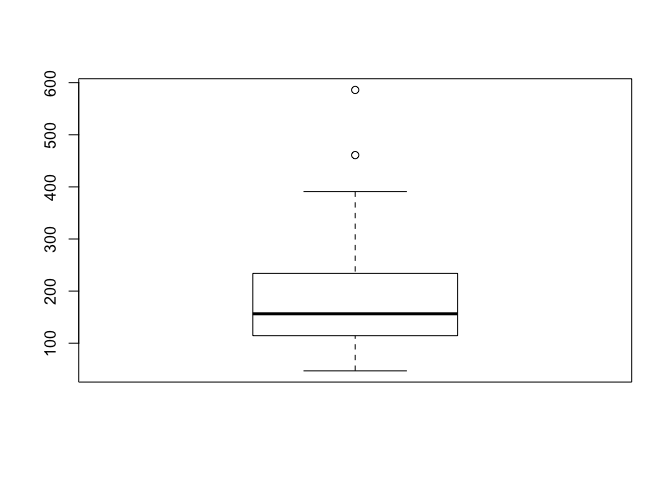
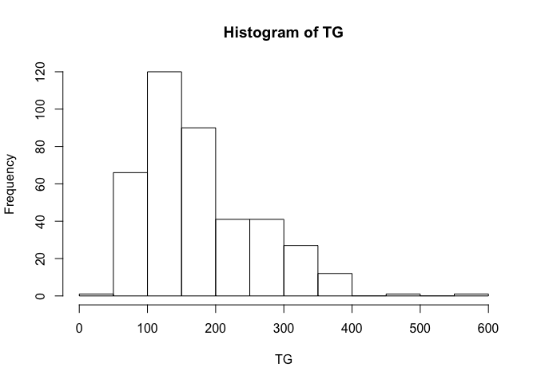
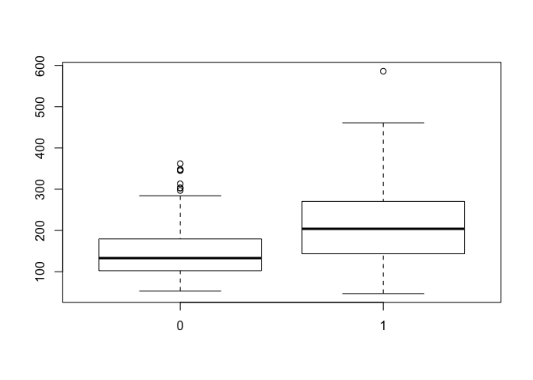
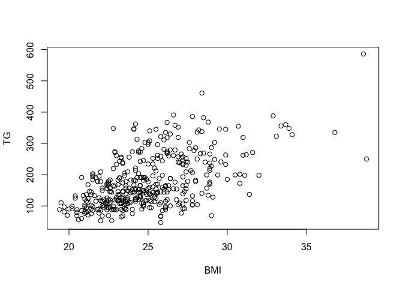

# shrinkage_estimation-bayesian-MCMC
Ruijuan Li  
7/27/2017  

# linear regression 

```r
# install all the required packages 
# install.packages("gee")
# install.packages("multcomp")
library(gee)
library(multcomp)
```

```
## Warning: package 'multcomp' was built under R version 3.2.5
```

```
## Loading required package: mvtnorm
```

```
## Warning: package 'mvtnorm' was built under R version 3.2.5
```

```
## Loading required package: survival
```

```
## Warning: package 'survival' was built under R version 3.2.5
```

```
## Loading required package: TH.data
```

```
## Warning: package 'TH.data' was built under R version 3.2.5
```

```
## Loading required package: MASS
```

```
## 
## Attaching package: 'TH.data'
```

```
## The following object is masked from 'package:MASS':
## 
##     geyser
```

# lab1, association between triglycerides & BMI??? 
https://github.com/leejimmy93/summer_institute/blob/master/module_4_regression_and_ANOVA/2016_SISG_4_2.pdf (slides 1-58)

```r
cholesterol = read.table("http://faculty.washington.edu/rhubb/sisg/SISG-Data-cholesterol.txt", header=T)
attach(cholesterol) # make variables global available in R studio 
# compute univariate summary statistics for triglycerides
dim(cholesterol) # 400 
```

```
## [1] 400   9
```

```r
# take a look at the data 
mean(TG)
```

```
## [1] 177.44
```

```r
median(TG)
```

```
## [1] 156.5
```

```r
sd(TG)
```

```
## [1] 82.98323
```

```r
summary(TG)
```

```
##    Min. 1st Qu.  Median    Mean 3rd Qu.    Max. 
##    47.0   114.8   156.5   177.4   234.0   586.0
```

```r
# graphical displays for triglycerides
boxplot(TG)
```

<!-- -->

```r
stem(TG) # ??? similar to histogram, but in a numeric pattern 
```

```
## 
##   The decimal point is 2 digit(s) to the right of the |
## 
##   0 | 
##   0 | 5556677777777778888888888999999999999999999999999999999
##   1 | 00000000000000000000011111111111111111111111122222222222222222222222+34
##   1 | 55555555555555555555555555666666666666666666677777777777777777778888+18
##   2 | 00000000000001111111112222333333334444444444444
##   2 | 5555555566666666666667777777777778888888899
##   3 | 0000001112222233444444
##   3 | 5555555566666778999
##   4 | 
##   4 | 6
##   5 | 
##   5 | 9
```

```r
?stem
hist(TG)
```

<!-- -->

```r
# creat a binary indicator for BMI > 25 
ibmi <- ifelse(BMI > 25, 1, 0)  # arbitrarily devide BMI into 2 groups 
ibmi
```

```
##   [1] 1 0 0 0 1 0 0 0 0 0 0 1 0 0 1 1 1 0 0 1 0 0 0 0 0 1 0 1 0 0 0 1 0 1 0
##  [36] 1 0 0 1 0 1 1 0 0 0 1 1 0 1 1 1 0 0 1 0 0 0 0 1 0 1 1 0 1 1 0 0 1 0 1
##  [71] 1 0 0 0 0 0 1 1 0 1 1 0 0 1 1 0 1 0 1 0 1 1 0 1 0 0 1 1 1 1 0 1 1 0 1
## [106] 0 0 0 1 1 0 1 0 0 0 0 0 0 1 1 1 1 0 1 0 1 1 0 1 1 0 0 0 1 0 0 0 1 0 1
## [141] 1 1 1 0 0 0 0 0 1 1 1 1 0 0 1 1 0 1 1 0 0 1 0 1 0 1 0 0 1 0 0 0 1 1 0
## [176] 1 0 0 0 0 1 1 0 1 1 0 0 1 1 0 0 1 0 0 0 0 0 0 0 0 1 1 0 1 0 1 0 0 1 1
## [211] 0 0 1 0 1 1 0 1 0 1 0 0 0 0 0 0 0 1 1 0 0 1 0 0 1 0 0 0 0 1 0 0 0 0 1
## [246] 1 0 0 0 1 1 0 0 0 1 0 0 1 1 0 0 1 1 1 0 1 0 0 1 1 1 1 0 1 0 1 0 1 0 1
## [281] 1 1 1 1 0 0 1 1 1 0 0 0 0 0 1 1 1 0 0 0 0 0 1 1 0 1 1 1 1 1 0 0 0 1 1
## [316] 1 1 1 0 0 0 1 1 1 0 1 0 1 0 0 1 0 0 0 0 0 0 0 1 1 0 0 0 1 1 0 0 0 0 1
## [351] 1 0 1 1 0 0 0 1 1 0 0 0 0 1 0 0 0 0 1 0 0 1 0 0 0 1 0 1 0 0 1 0 1 0 1
## [386] 1 0 1 0 0 1 1 1 1 1 1 0 0 0 0
```

```r
# compute univariate summary statistics for triglycerides for BMI > 25 and BMI <= 25
tapply(TG,ibmi,mean)
```

```
##        0        1 
## 147.3839 215.6932
```

```r
tapply(TG,ibmi,median)
```

```
##   0   1 
## 133 204
```

```r
tapply(TG,ibmi,sd)
```

```
##        0        1 
## 61.70787 90.66584
```

```r
# tapply(vector, index, function)

# plot boxplots for triglycerides separately by BMI > 25 and BMI <= 25
boxplot(TG ~ ibmi) # summary boxplot for the 2 groups with different BMI 
```

<!-- -->

```r
t.test(TG ~ ibmi) # doing t-test to see whether there is association 
```

```
## 
## 	Welch Two Sample t-test
## 
## data:  TG by ibmi
## t = -8.5584, df = 294.91, p-value = 6.391e-16
## alternative hypothesis: true difference in means is not equal to 0
## 95 percent confidence interval:
##  -84.01732 -52.60118
## sample estimates:
## mean in group 0 mean in group 1 
##        147.3839        215.6932
```

```r
# instead of t-test, using continous predictor and outcome values to test for association 
# scatterplot of triglycerides vs BMI
plot(BMI, TG)
```

<!-- -->

```r
# fit linear regression models for the association between triglycerdies and BMI
fit1 = lm(TG ~ BMI)
?glm # more generlized, can use glm for lm 
summary(fit1)
```

```
## 
## Call:
## lm(formula = TG ~ BMI)
## 
## Residuals:
##     Min      1Q  Median      3Q     Max 
## -170.19  -45.10  -12.89   39.60  231.08 
## 
## Coefficients:
##             Estimate Std. Error t value Pr(>|t|)    
## (Intercept)  -208.50      28.95  -7.203 2.97e-12 ***
## BMI            15.44       1.15  13.429  < 2e-16 ***
## ---
## Signif. codes:  0 '***' 0.001 '**' 0.01 '*' 0.05 '.' 0.1 ' ' 1
## 
## Residual standard error: 68.93 on 398 degrees of freedom
## Multiple R-squared:  0.3118,	Adjusted R-squared:  0.3101 
## F-statistic: 180.3 on 1 and 398 DF,  p-value: < 2.2e-16
```

```r
confint(fit1) # confidence interval 
```

```
##                  2.5 %     97.5 %
## (Intercept) -265.40761 -151.59430
## BMI           13.17743   17.69754
```

```r
fit1$coefficients 
```

```
## (Intercept)         BMI 
##  -208.50096    15.43748
```

```r
# compute the predicted value and its 95% confidence interval for the mean value of TG at BMI=23 as well
# as for a new individual w/ BMI=23. 
predict(fit1, newdata = data.frame(BMI = 23), interval = "confidence") # predicted value and its 95% confidence interval for the mean value of TG at BMI=23
```

```
##        fit      lwr      upr
## 1 146.5612 138.4161 154.7062
```

```r
predict(fit1, newdata = data.frame(BMI = 23), interval = "prediction") # predicted value and its 95% confidence interval for a new individual w/ BMI=23
```

```
##        fit      lwr      upr
## 1 146.5612 10.80972 282.3126
```

```r
# How do these two intervals differ and why?
# the predicted value for these two are the same but the intervals for predicted value for new individuals are much bigger, because it includes the random variability around the mean. 
```


