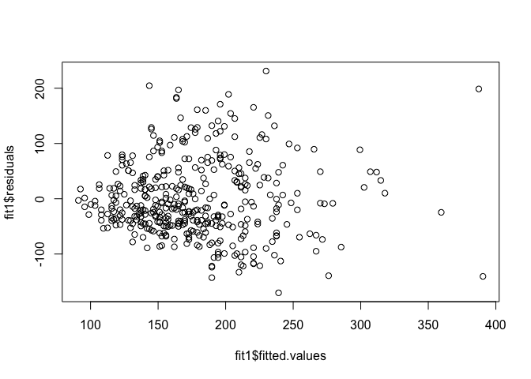
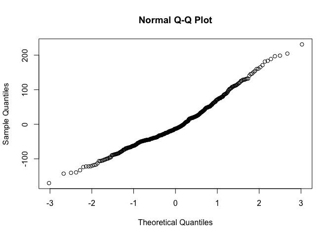

# 08-05-2017
Ruijuan Li  
8/5/2017  

### sum of square 

sum of square (R square explans how the model fit, low values of R squre indicate that the model is not adequate, however, high values of R square don't mean that the model is adequate.)

### load previous data 

```r
library(gee)
library(multcomp)
```

```
## Warning: package 'multcomp' was built under R version 3.2.5
```

```
## Loading required package: mvtnorm
```

```
## Warning: package 'mvtnorm' was built under R version 3.2.5
```

```
## Loading required package: survival
```

```
## Warning: package 'survival' was built under R version 3.2.5
```

```
## Loading required package: TH.data
```

```
## Warning: package 'TH.data' was built under R version 3.2.5
```

```
## Loading required package: MASS
```

```
## 
## Attaching package: 'TH.data'
```

```
## The following object is masked from 'package:MASS':
## 
##     geyser
```

```r
cholesterol = read.table("http://faculty.washington.edu/rhubb/sisg/SISG-Data-cholesterol.txt", header=T)
attach(cholesterol) # make variables global available in R studio 
dim(cholesterol) # 400 
```

```
## [1] 400   9
```

```r
# fit linear regression models for the association between triglycerdies and BMI
fit1 = lm(TG ~ BMI)
confint(fit1) # confidence interval 
```

```
##                  2.5 %     97.5 %
## (Intercept) -265.40761 -151.59430
## BMI           13.17743   17.69754
```

```r
# compute the predicted value and its 95% confidence interval for the mean value of TG at BMI=23 as well
# as for a new individual w/ BMI=23. 
predict(fit1, newdata = data.frame(BMI = 23), interval = "confidence") # predicted value and its 95% confidence interval for the mean value of TG at BMI=23
```

```
##        fit      lwr      upr
## 1 146.5612 138.4161 154.7062
```

```r
predict(fit1, newdata = data.frame(BMI = 23), interval = "prediction") # predicted value and its 95% confidence interval for a new individual w/ BMI=23
```

```
##        fit      lwr      upr
## 1 146.5612 10.80972 282.3126
```

### simple linear regression assumption:
linearity, indepdence, normality, equal variance of residual 

```r
# plot of residuals VS. fitted values curvatures, heteroscendasticity? 
plot(fit1$fitted.values, fit1$residuals)
```

<!-- -->

```r
# plot of residuals VS. quantiles of a normal distribution, normality? 
qqnorm(fit1$residuals)
```

<!-- -->

Sometimes variance of y is not constant across the range of x (heteroscedasticity), Little effect on point estimates but variance estimates will be incorrect, This affects confidence intervals and p-values. 

To account for heteroscedasticity we can, we can
      
* use robust standard error
      
* transform the data
      
* Fit a model that does not assume constant variance (GLM)
      
Some reasons for using data transformations
      
* Original data suggest nonlinearity
      
* Equal variance assumption violated
      
* Normality assumption violated
      
  


