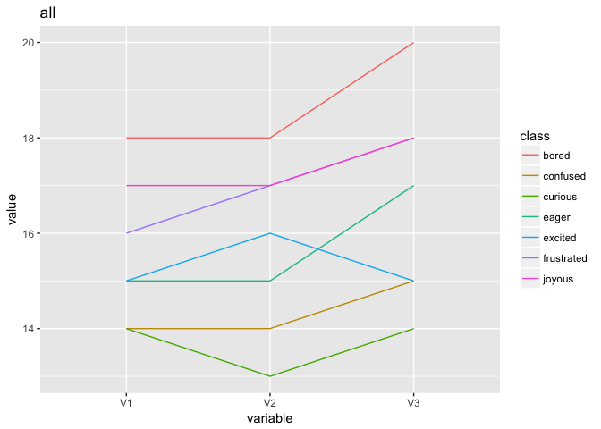
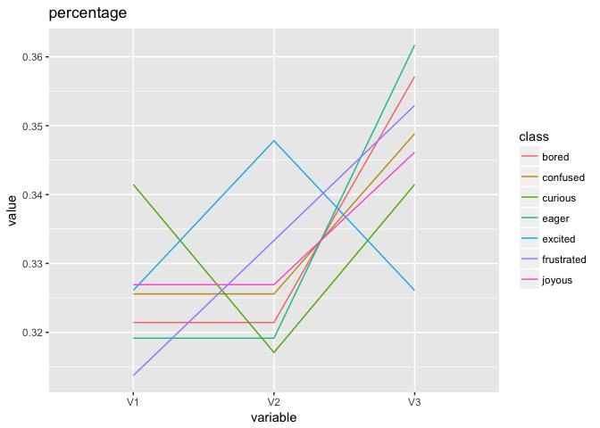

# chi_square_test
Ruijuan Li  
8/11/2017  

#### import data 

```r
library(ggplot2)
```

```
## Warning: package 'ggplot2' was built under R version 3.2.5
```

```r
library(dplyr)
```

```
## Warning: package 'dplyr' was built under R version 3.2.5
```

```
## 
## Attaching package: 'dplyr'
```

```
## The following objects are masked from 'package:stats':
## 
##     filter, lag
```

```
## The following objects are masked from 'package:base':
## 
##     intersect, setdiff, setequal, union
```

```r
library(tidyverse)
```

```
## Warning: package 'tidyverse' was built under R version 3.2.5
```

```
## Loading tidyverse: tibble
## Loading tidyverse: tidyr
## Loading tidyverse: readr
## Loading tidyverse: purrr
```

```
## Warning: package 'tibble' was built under R version 3.2.5
```

```
## Warning: package 'tidyr' was built under R version 3.2.5
```

```
## Warning: package 'readr' was built under R version 3.2.5
```

```
## Warning: package 'purrr' was built under R version 3.2.5
```

```
## Conflicts with tidy packages ----------------------------------------------
```

```
## filter(): dplyr, stats
## lag():    dplyr, stats
```

```r
library(reshape2)
```

```
## Warning: package 'reshape2' was built under R version 3.2.5
```

```
## 
## Attaching package: 'reshape2'
```

```
## The following object is masked from 'package:tidyr':
## 
##     smiths
```

```r
data <- read.table("~/Desktop/bioinfo_miscs/08-11-2017/note.txt", sep = ",")

data.m1 <- 
data %>%
  separate(V1, into=c("class", "V1"), sep=":")

data.m1
```

```
##        class  V1 V2 V3
## 1    excited  15 16 15
## 2     joyous  17 17 18
## 3    curious  14 13 14
## 4      eager  15 15 17
## 5   confused  14 14 15
## 6 frustrated  16 17 18
## 7      bored  18 18 20
```

```r
data.m1$V1 <- as.numeric(data.m1$V1)
rownames(data.m1) <- data.m1$class
data.final <- data.m1 %>%
  select(-class)

str(data.final)
```

```
## 'data.frame':	7 obs. of  3 variables:
##  $ V1: num  15 17 14 15 14 16 18
##  $ V2: int  16 17 13 15 14 17 18
##  $ V3: int  15 18 14 17 15 18 20
```

```r
# plot the original data 
data.m1 %>%
  melt() %>%
  ggplot() + 
  geom_line(aes(x=variable, y=value, color=class, group=class)) +
  labs(title = "all")
```

```
## Using class as id variables
```

<!-- -->

```r
# transform to percentage
data.m1.per <- sapply(data.m1[2:4], function(x) x/rowSums(data.m1[2:4])) %>% as.data.frame() 

data.m1.per$class <- rownames(data.m1.per)

data.m1.per %>%
  melt() %>%
  ggplot() +
  geom_line(aes(x=variable, y=value, color=class, group=class)) +
  labs(title = "percentage")
```

```
## Using class as id variables
```

<!-- -->

##### chi-square test
I guess you are asking whether choose different emotions are depending on some factors in the column names, if that is the case, here is the result, choosing which emotion is independ of the factors you measured. p-value = 1. 

```r
library(MASS)
```

```
## 
## Attaching package: 'MASS'
```

```
## The following object is masked from 'package:dplyr':
## 
##     select
```

```r
# on orignal data 
chisq.test(data.final)
```

```
## 
## 	Pearson's Chi-squared test
## 
## data:  data.final
## X-squared = 0.26702, df = 12, p-value = 1
```

```r
# on percentage data 
chisq.test(data.m1.per[,1:3])  
```

```
## Warning in chisq.test(data.m1.per[, 1:3]): Chi-squared approximation may be
## incorrect
```

```
## 
## 	Pearson's Chi-squared test
## 
## data:  data.m1.per[, 1:3]
## X-squared = 0.0057863, df = 12, p-value = 1
```

```r
chisq.test(data.m1.per[1,1:3])  
```

```
## Warning in chisq.test(data.m1.per[1, 1:3]): Chi-squared approximation may
## be incorrect
```

```
## 
## 	Chi-squared test for given probabilities
## 
## data:  data.m1.per[1, 1:3]
## X-squared = 0.00094518, df = 2, p-value = 0.9995
```

```r
data.final[1,]
```

```
##         V1 V2 V3
## excited 15 16 15
```

```r
chisq.test(data.final[1,])
```

```
## 
## 	Chi-squared test for given probabilities
## 
## data:  data.final[1, ]
## X-squared = 0.043478, df = 2, p-value = 0.9785
```

```r
chisq.test(data.final[2,])
```

```
## 
## 	Chi-squared test for given probabilities
## 
## data:  data.final[2, ]
## X-squared = 0.038462, df = 2, p-value = 0.981
```

```r
chisq.test(data.final[3,])
```

```
## 
## 	Chi-squared test for given probabilities
## 
## data:  data.final[3, ]
## X-squared = 0.04878, df = 2, p-value = 0.9759
```

```r
chisq.test(data.final[4,])
```

```
## 
## 	Chi-squared test for given probabilities
## 
## data:  data.final[4, ]
## X-squared = 0.17021, df = 2, p-value = 0.9184
```

```r
chisq.test(data.final[5,])
```

```
## 
## 	Chi-squared test for given probabilities
## 
## data:  data.final[5, ]
## X-squared = 0.046512, df = 2, p-value = 0.977
```

```r
chisq.test(data.final[6,])
```

```
## 
## 	Chi-squared test for given probabilities
## 
## data:  data.final[6, ]
## X-squared = 0.11765, df = 2, p-value = 0.9429
```

```r
chisq.test(data.final[7,]) 
```

```
## 
## 	Chi-squared test for given probabilities
## 
## data:  data.final[7, ]
## X-squared = 0.14286, df = 2, p-value = 0.9311
```

