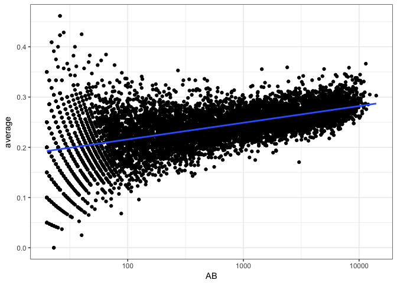

# beta_binomial_bernoulli_distibution
Ruijuan Li  
8/15/2017  

A Bernoulli random variable has two possible outcomes: 00 or 11. A binomial distribution is the sum of independent and identically distributed Bernoulli random variables. 

So for example, say I have a coin, and when tossed, the probability it lands heads is pp. So the probability that it lands tails is 1−p1−p (there are no other possible outcomes for the coin toss). If the coin lands heads, you win one dollar. If the coin lands tails, you win nothing.

For a single coin toss, the probability you win one dollar is pp. The random variable that represents your winnings after one coin toss is a Bernoulli random variable.

Now, if you toss the coin 55 times, your winnings could be any whole number of dollars from zero dollars to five dollars, inclusive. The probability that you win five dollars is p5p5, because each coin toss is independent of the others, and for each coin toss, the probability of heads is pp.

What is the probability that you win exactly three dollars in five tosses? That would require you to toss the coin five times, getting exactly three heads and two tails. This can be achieved with probability (53)p3(1−p)2(53)p3(1−p)2. And in general, if there are nn Bernoulli trials, then the sum of those trials is binomially distributed with parameters nn and pp.

Note that a binomial random variable with parameter n=1n=1 is equivalent to a Bernoulli random variable--there only one trial.

### binomial distibution eg  
*  The binomial distribution is a discrete probability distribution. It describes the outcome of n independent trials in an experiment. Each trial is assumed to have only two outcomes, either success or failure. If the probability of a successful trial is p, then the probability of having x successful outcomes in an experiment of n independent trials is as follows.

* Problem

Suppose there are twelve multiple choice questions in an English class quiz. Each question has five possible answers, and only one of them is correct. Find the probability of having four or less correct answers if a student attempts to answer every question at random.

* Solution

Since only one out of five possible answers is correct, the probability of answering a question correctly by random is 1/5=0.2. We can find the probability of having exactly 4 correct answers by random attempts as follows.


```r
dbinom(4, size=12, prob=0.2)
```

```
## [1] 0.1328756
```

```r
?dbinom
```

To find the probability of having four or less correct answers by random attempts, we apply the function dbinom with x = 0,…,4.

```r
dbinom(0, size=12, prob=0.2) + 
+ dbinom(1, size=12, prob=0.2) + 
+ dbinom(2, size=12, prob=0.2) + 
+ dbinom(3, size=12, prob=0.2) + 
+ dbinom(4, size=12, prob=0.2)
```

```
## [1] 0.9274445
```

Alternatively, we can use the cumulative probability function for binomial distribution pbinom.


```r
pbinom(4, size=12, prob=0.2)
```

```
## [1] 0.9274445
```

```r
?pbinom
```

* Answer
The probability of four or less questions answered correctly by random in a twelve question multiple choice quiz is 92.7%. 

### Beta distribution
A baseball example 
http://varianceexplained.org/statistics/beta_distribution_and_baseball/

### Beta-binomial distribution

```r
library(dplyr)
```

```
## Warning: package 'dplyr' was built under R version 3.2.5
```

```
## 
## Attaching package: 'dplyr'
```

```
## The following objects are masked from 'package:stats':
## 
##     filter, lag
```

```
## The following objects are masked from 'package:base':
## 
##     intersect, setdiff, setequal, union
```

```r
library(tidyr)
```

```
## Warning: package 'tidyr' was built under R version 3.2.5
```

```r
library(Lahman)
```

```
## Warning: package 'Lahman' was built under R version 3.2.5
```

```r
library(ggplot2)
```

```
## Warning: package 'ggplot2' was built under R version 3.2.5
```

```r
theme_set(theme_bw())

# Grab career batting average of non-pitchers
# (allow players that have pitched <= 3 games, like Ty Cobb)
pitchers <- Pitching %>%
  group_by(playerID) %>%
  summarize(gamesPitched = sum(G)) %>%
  filter(gamesPitched > 3)

career <- Batting %>%
  filter(AB > 0) %>%
  anti_join(pitchers, by = "playerID") %>%
  group_by(playerID) %>%
  summarize(H = sum(H), AB = sum(AB)) %>%
  mutate(average = H / AB)

# Add player names
career <- Master %>%
  tbl_df() %>%
  dplyr::select(playerID, nameFirst, nameLast) %>%
  unite(name, nameFirst, nameLast, sep = " ") %>%
  inner_join(career, by = "playerID")

# Estimate hyperparameters alpha0 and beta0 for empirical Bayes
career_filtered <- career %>% filter(AB >= 500) 
m <- MASS::fitdistr(career_filtered$average, dbeta, # x & density function 
                    start = list(shape1 = 1, shape2 = 10)) # list to start
```

```
## Warning in densfun(x, parm[1], parm[2], ...): NaNs produced
```

```
## Warning in densfun(x, parm[1], parm[2], ...): NaNs produced

## Warning in densfun(x, parm[1], parm[2], ...): NaNs produced
```

```r
?fitdistr # Maximum-likelihood fitting of univariate distributions 

alpha0 <- m$estimate[1]
beta0 <- m$estimate[2]
prior_mu <- alpha0 / (alpha0 + beta0)

# For each player, update the beta prior based on the evidence
# to get posterior parameters alpha1 and beta1
career_eb <- career %>%
  mutate(eb_estimate = (H + alpha0) / (AB + alpha0 + beta0)) %>% # what is H? what is AB? stand for the number of hit and not hit baseball???  
  mutate(alpha1 = H + alpha0, 
         beta1 = AB - H + beta0) %>%
  arrange(desc(eb_estimate))
```

Recall that the eb_estimate column gives us estimates about each player’s batting average, estimated from a combination of each player’s record with the beta prior parameters estimated from everyone (, ). For example, a player with only a single at-bat and a single hit () will have an empirical Bayes estimate of

Now, here’s the complication. Let’s compare at-bats (on a log scale) to the raw batting average:


```r
career %>%
  filter(AB >= 20) %>% # at bat greater than 20 
  ggplot(aes(AB, average)) + 
  geom_point() +
  geom_smooth(method = "lm", se = FALSE) +
  scale_x_log10()
```

<!-- -->

We notice that batters with low ABs have more variance in our estimates- that’s a familiar pattern because we have less information about them. But notice a second trend: as the number of at-bats increases, the batting average also increases. Unlike the variance, this is not an artifact of our measurement: it’s a result of the choices of baseball managers! Better batters get played more: they’re more likely to be in the starting lineup and to spend more years playing professionally. 


