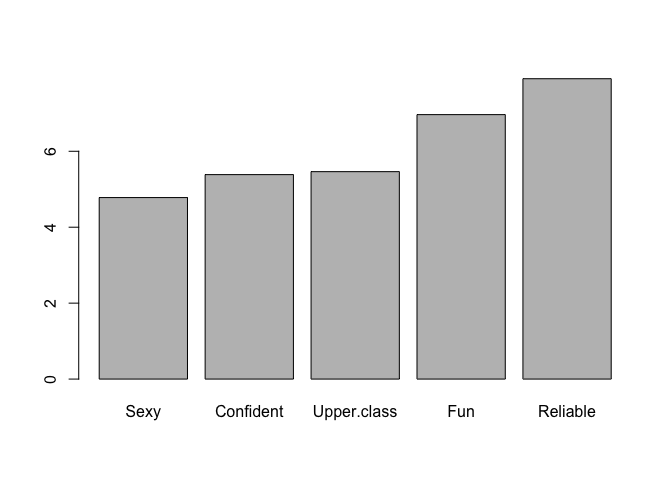

### What is partial least square? 

http://www.eigenvector.com/Docs/Wise_pls_properties.pdf 

Partial least squares (PLS) regression is a technique that reduces the predictors to a smaller set of uncorrelated components and performs least squares regression on these components, instead of on the original data. 

### why PLS? 

PLS regression is particularly suited when the matrix of predictors has more variables than observations, and when there is multicollinearity among X values. By contrast, standard regression will fail in these cases (unless it is regularized).

### difference between PLS, simple linear regression, multiple linear regression, nonlinear regression,least squares regression, ordinary least-squares regression, PCR (principle component regression)  

* least square regression: 

The method of least squares is a standard approach in regression analysis to approximate the solution of overdetermined systems, i.e., sets of equations in which there are more equations than unknowns. Least-squares problems fall into two categories: linear or ordinary least squares and nonlinear least squares, depending on whether or not the residuals are linear in all unknowns. 

* linear regression, nonlinear regression

linear regression: Linear least squares is the least squares approximation of linear functions to data. It is a set of formulations for solving statistical problems involved in linear regression, including ordinary least square (OLS), weighted least square (WLS), generalized least square (GLS). simple linear regression is a linear regression model with a single explanatory variable; when there are multiple explantory variables, termed as multiple linear regression. 

generalized linear model (GLM) is a flexible generalization of ordinary linear regression that allows for response variables that have error distribution models other than a normal distribution. 

generalized linear square (GLS) is a technique for estimating the unknown parameters in a linear regression model when there is a certain degree of correlation between the residuals in a regression model. This special case of GLS is called "weighted least squares". 

Non-linear least squares is the form of least squares analysis used to fit a set of m observations with a model that is non-linear in n unknown parameters (m > n). 

PCR: principal component regression (PCR) is a regression analysis technique that is based on principal component analysis (PCA). Typically, it considers regressing the outcome (also known as the response or the dependent variable) on a set of covariates (also known as predictors, or explanatory variables, or independent variables) based on a standard linear regression model, but uses PCA for estimating the unknown regression coefficients in the model. 

Similar to PCR, PLS also uses derived covariates of lower dimensions. However unlike PCR, the derived covariates for PLS are obtained based on using both the outcome as well as the covariates. While PCR seeks the high variance directions in the space of the covariates, PLS seeks the directions in the covariate space that are most useful for the prediction of the outcome.

### how to use it for analysis? 

https://www.displayr.com/using-partial-least-squares-to-conduct-relative-importance-analysis-in-r/

```r
cola.url = "http://wiki.q-researchsoftware.com/images/d/db/Stacked_colas.csv"
colas = read.csv(cola.url)
str(colas)
```

```
## 'data.frame':	1893 obs. of  37 variables:
##  $ pref                   : int  2 2 2 1 4 5 1 1 4 4 ...
##  $ URLID                  : num  1.38e+08 1.38e+08 1.38e+08 1.38e+08 1.38e+08 ...
##  $ Beautiful              : int  0 0 0 0 0 0 0 1 0 0 ...
##  $ Carefree               : int  0 0 1 1 1 0 0 0 1 1 ...
##  $ Charming               : int  0 0 0 0 0 0 0 0 1 1 ...
##  $ Confident              : int  0 0 1 1 1 1 1 0 0 0 ...
##  $ Down.to.earth          : int  1 0 0 0 1 1 0 0 0 0 ...
##  $ Feminine               : int  0 0 0 0 0 0 0 1 0 0 ...
##  $ Fun                    : int  0 0 1 0 1 1 0 0 0 0 ...
##  $ Health.conscious       : int  0 0 0 0 0 0 1 1 0 0 ...
##  $ Hip                    : int  0 0 1 1 1 1 0 0 1 0 ...
##  $ Honest                 : int  0 0 0 0 1 1 0 0 0 0 ...
##  $ Humorous               : int  0 0 0 0 1 0 0 0 0 0 ...
##  $ Imaginative            : int  0 0 1 0 0 1 0 0 0 0 ...
##  $ Individualistic        : int  0 0 1 1 1 0 0 0 1 0 ...
##  $ Innocent               : int  0 0 0 0 0 1 0 1 0 0 ...
##  $ Intelligent            : int  1 1 0 0 1 0 0 0 0 0 ...
##  $ Masculine              : int  0 0 1 0 1 0 0 0 1 1 ...
##  $ Older                  : int  0 0 0 0 0 1 0 1 0 0 ...
##  $ Open.to.new.experiences: int  0 0 0 0 1 0 0 0 1 1 ...
##  $ Outdoorsy              : int  0 0 1 1 1 0 0 0 0 0 ...
##  $ Rebellious             : int  0 0 1 1 0 0 0 0 0 1 ...
##  $ Reckless               : int  0 0 1 1 0 0 0 0 0 0 ...
##  $ Reliable               : int  1 0 0 0 1 1 0 0 1 0 ...
##  $ Sexy                   : int  0 0 1 1 0 0 0 1 0 0 ...
##  $ Sleepy                 : int  0 0 0 0 0 0 0 0 0 0 ...
##  $ Tough                  : int  0 0 1 1 1 0 0 0 1 1 ...
##  $ Traditional            : int  1 0 0 0 1 1 0 0 1 0 ...
##  $ Trying.to.be.cool      : int  1 1 1 1 0 0 0 0 1 0 ...
##  $ Unconventional         : int  0 0 1 0 1 0 0 0 0 0 ...
##  $ Up.to.date             : int  0 0 1 0 1 0 1 0 1 0 ...
##  $ Upper.class            : int  1 0 0 0 1 0 0 0 1 1 ...
##  $ Urban                  : int  0 1 1 1 1 0 0 0 0 0 ...
##  $ Weight.conscious       : int  1 1 0 0 0 0 1 1 0 0 ...
##  $ Wholesome              : int  0 0 0 0 0 0 0 0 0 0 ...
##  $ Youthful               : int  0 0 1 1 1 0 0 0 1 0 ...
##  $ brand                  : Factor w/ 6 levels "Coke","Coke Zero",..: 3 4 6 2 5 1 2 3 1 5 ...
```

```r
colas = subset(colas, select = -c(URLID, brand))
 
library(pls)
```

```
## Warning: package 'pls' was built under R version 3.2.5
```

```
## 
## Attaching package: 'pls'
```

```
## The following object is masked from 'package:stats':
## 
##     loadings
```

```r
pls.model = plsr(pref ~ ., data = colas, validation = "CV")
 
# Find the number of dimensions with lowest cross validation error
cv = RMSEP(pls.model)
best.dims = which.min(cv$val[estimate = "adjCV", , ]) - 1
 
# Rerun the model
pls.model = plsr(pref ~ ., data = colas, ncomp = best.dims)

coefficients = coef(pls.model)
sum.coef = sum(sapply(coefficients, abs))
coefficients = coefficients * 100 / sum.coef
coefficients = sort(coefficients[, 1 , 1])
barplot(tail(coefficients, 5)) 
```

<!-- -->

