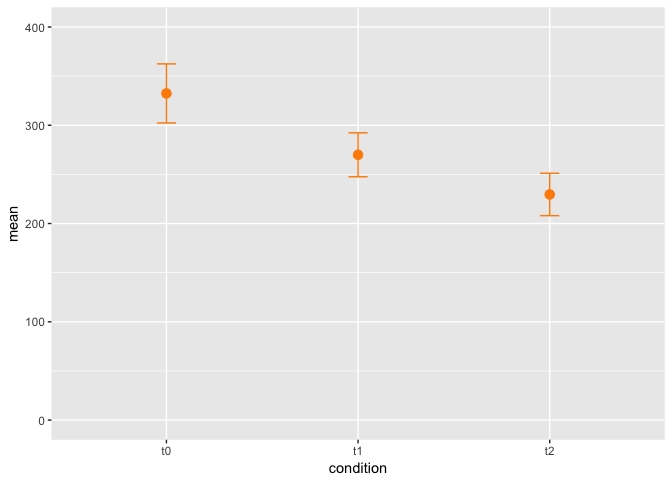
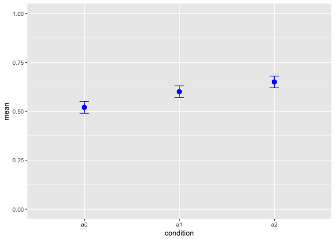

Yang has user study inforamtion from 18 people, including time and accurary value collected from three conditions. These 3 conditions are repeated measures, so I will use repeated measure to check whether there is significant difference among the three conditions interms of time and accuary. Benferroni correction will be used afterwards to correct for the P-value. In the end, need to make plot to show the result. 


```r
# load package 
library(tidyverse)
```

```
## ── Attaching packages ────────────────────────────────── tidyverse 1.2.1 ──
```

```
## ✔ ggplot2 2.2.1     ✔ purrr   0.2.4
## ✔ tibble  1.4.2     ✔ dplyr   0.7.4
## ✔ tidyr   0.8.0     ✔ stringr 1.3.0
## ✔ readr   1.1.1     ✔ forcats 0.3.0
```

```
## Warning: package 'ggplot2' was built under R version 3.2.5
```

```
## Warning: package 'readr' was built under R version 3.2.5
```

```
## Warning: package 'purrr' was built under R version 3.2.5
```

```
## Warning: package 'dplyr' was built under R version 3.2.5
```

```
## ── Conflicts ───────────────────────────────────── tidyverse_conflicts() ──
## ✖ dplyr::filter() masks stats::filter()
## ✖ dplyr::lag()    masks stats::lag()
```

```r
library(nlme)
```

```
## Warning: package 'nlme' was built under R version 3.2.5
```

```
## 
## Attaching package: 'nlme'
```

```
## The following object is masked from 'package:dplyr':
## 
##     collapse
```

```r
library(reshape2)
```

```
## Warning: package 'reshape2' was built under R version 3.2.5
```

```
## 
## Attaching package: 'reshape2'
```

```
## The following object is masked from 'package:tidyr':
## 
##     smiths
```

```r
library(car)
```

```
## Loading required package: carData
```

```
## 
## Attaching package: 'car'
```

```
## The following object is masked from 'package:dplyr':
## 
##     recode
```

```
## The following object is masked from 'package:purrr':
## 
##     some
```

```r
# read data 
user <- read.csv("~/Desktop/everyday_stats_bioinformatics/12-16-2018_repeated_measure_Anova/user.csv")
user %>% dim()
```

```
## [1] 20  9
```

```r
user %>% str()
```

```
## 'data.frame':	20 obs. of  9 variables:
##  $ name  : Factor w/ 19 levels "","cms","fsw",..: 9 15 11 5 6 13 7 8 4 19 ...
##  $ t0    : num  261 156 459 206 354 ...
##  $ t1    : num  221 123 419 200 321 ...
##  $ t2    : num  190 101 378 179 279 ...
##  $ a0    : num  0.64 0.57 0.62 0.51 0.62 0.47 0.79 0.47 0.34 0.42 ...
##  $ a1    : num  0.72 0.6 0.65 0.53 0.7 0.49 0.79 0.63 0.42 0.51 ...
##  $ a2    : num  0.77 0.66 0.71 0.57 0.74 0.51 0.83 0.69 0.43 0.57 ...
##  $ age   : num  24 28 24 23 26 27 23 24 26 27 ...
##  $ gender: Factor w/ 2 levels "","m": 1 2 1 1 2 1 1 1 1 2 ...
```

```r
# format data 
user_time <- 
user %>% 
  dplyr::select(name:t2) 

user_time <- user_time[1:18,]
user_time %>% head()
```

```
##   name    t0    t1    t2
## 1  qjy 260.8 221.3 189.5
## 2   yy 155.8 122.7 100.8
## 3  wld 458.7 419.3 378.1
## 4   hm 206.5 199.9 179.3
## 5  lcy 353.8 320.9 278.6
## 6  yll 473.7 401.8 382.9
```

```r
user_accuary <- 
user %>% 
  dplyr::select(name, a0:a2) 

user_accuary <- user_accuary[1:18,]
user_accuary %>% head()
```

```
##   name   a0   a1   a2
## 1  qjy 0.64 0.72 0.77
## 2   yy 0.57 0.60 0.66
## 3  wld 0.62 0.65 0.71
## 4   hm 0.51 0.53 0.57
## 5  lcy 0.62 0.70 0.74
## 6  yll 0.47 0.49 0.51
```

### time 

```r
# make a linear model with only the intercept as the predictor for within-participant observations 
model1 <- lm(cbind(user_time$t0, user_time$t1, user_time$t2) ~ 1)
model1
```

```
## 
## Call:
## lm(formula = cbind(user_time$t0, user_time$t1, user_time$t2) ~ 
##     1)
## 
## Coefficients:
##              [,1]   [,2]   [,3] 
## (Intercept)  332.4  269.9  229.6
```

```r
conditions <- factor(colnames(user_time[2:4]), ordered = F) # factors for repeated measures variable 
conditions
```

```
## [1] t0 t1 t2
## Levels: t0 t1 t2
```

```r
model2=Anova(model1,idata=data.frame(conditions),idesign=~conditions,type="III") # use the repeated-measures factor as the "internal" part of the deign using ANOVA
# idata parameter is for the repeated-measures part of the data, the ‘idesign’ is where you specify the repeated part of the design. This is a one-way within design, so we have only the ‘Trials’ variable.

summary(model2,multivariate=F) # p-value is 1.654e-09, significant 
```

```
## 
## Univariate Type III Repeated-Measures ANOVA Assuming Sphericity
## 
##              Sum Sq num Df Error SS den Df F value    Pr(>F)    
## (Intercept) 4152179      1   592891     17 119.056 4.249e-09 ***
## conditions    96563      2    42256     34  38.849 1.654e-09 ***
## ---
## Signif. codes:  0 '***' 0.001 '**' 0.01 '*' 0.05 '.' 0.1 ' ' 1
## 
## 
## Mauchly Tests for Sphericity
## 
##            Test statistic    p-value
## conditions        0.19151 1.8098e-06
## 
## 
## Greenhouse-Geisser and Huynh-Feldt Corrections
##  for Departure from Sphericity
## 
##             GG eps Pr(>F[GG])    
## conditions 0.55295   3.63e-06 ***
## ---
## Signif. codes:  0 '***' 0.001 '**' 0.01 '*' 0.05 '.' 0.1 ' ' 1
## 
##              HF eps   Pr(>F[HF])
## conditions 0.563296 3.034104e-06
```

```r
# pairwise 
c1=t.test(user_time$t0,user_time$t1,alternative="two.sided",mu=0,paired=T) 
c2=t.test(user_time$t0,user_time$t2,alternative="two.sided",mu=0,paired=T) 
c3=t.test(user_time$t1,user_time$t2,alternative="two.sided",mu=0,paired=T) 
c1; c2; c3
```

```
## 
## 	Paired t-test
## 
## data:  user_time$t0 and user_time$t1
## t = 4.666, df = 17, p-value = 0.0002217
## alternative hypothesis: true difference in means is not equal to 0
## 95 percent confidence interval:
##  34.20583 90.67195
## sample estimates:
## mean of the differences 
##                62.43889
```

```
## 
## 	Paired t-test
## 
## data:  user_time$t0 and user_time$t2
## t = 6.9446, df = 17, p-value = 2.368e-06
## alternative hypothesis: true difference in means is not equal to 0
## 95 percent confidence interval:
##   71.56459 134.02430
## sample estimates:
## mean of the differences 
##                102.7944
```

```
## 
## 	Paired t-test
## 
## data:  user_time$t1 and user_time$t2
## t = 10.059, df = 17, p-value = 1.42e-08
## alternative hypothesis: true difference in means is not equal to 0
## 95 percent confidence interval:
##  31.89114 48.81997
## sample estimates:
## mean of the differences 
##                40.35556
```

```r
# adjust the p-value using Benferroni correction 
p.adjust(c(c1$p.value, c2$p.value, c3$p.value), method = "bonferroni", n = 18)   
```

```
## [1] 3.989848e-03 4.262060e-05 2.556817e-07
```

### accuracy

```r
model3 <- lm(cbind(user_accuary$a0, user_accuary$a1, user_accuary$a2) ~ 1)
model3
```

```
## 
## Call:
## lm(formula = cbind(user_accuary$a0, user_accuary$a1, user_accuary$a2) ~ 
##     1)
## 
## Coefficients:
##              [,1]    [,2]    [,3]  
## (Intercept)  0.5178  0.5989  0.6533
```

```r
conditions2 <- factor(colnames(user_accuary[2:4]), ordered = F) # factors for repeated measures variable 
conditions2
```

```
## [1] a0 a1 a2
## Levels: a0 a1 a2
```

```r
model4=Anova(model3,idata=data.frame(conditions2),idesign=~conditions2,type="III") # use the repeated-measures factor as the "internal" part of the deign using ANOVA

summary(model4,multivariate=F) # p-value is 1.654e-09, significant 
```

```
## 
## Univariate Type III Repeated-Measures ANOVA Assuming Sphericity
## 
##              Sum Sq num Df Error SS den Df F value    Pr(>F)    
## (Intercept) 18.7974      1  0.69833     17 457.598 9.942e-14 ***
## conditions2  0.1675      2  0.04816     34  59.135 8.525e-12 ***
## ---
## Signif. codes:  0 '***' 0.001 '**' 0.01 '*' 0.05 '.' 0.1 ' ' 1
## 
## 
## Mauchly Tests for Sphericity
## 
##             Test statistic    p-value
## conditions2        0.33859 0.00017275
## 
## 
## Greenhouse-Geisser and Huynh-Feldt Corrections
##  for Departure from Sphericity
## 
##             GG eps Pr(>F[GG])    
## conditions2 0.6019   6.28e-08 ***
## ---
## Signif. codes:  0 '***' 0.001 '**' 0.01 '*' 0.05 '.' 0.1 ' ' 1
## 
##               HF eps   Pr(>F[HF])
## conditions2 0.622567 3.947142e-08
```

```r
# pairwise 
c1.2=t.test(user_accuary$a0,user_accuary$a1,alternative="two.sided",mu=0,paired=T) 
c2.2=t.test(user_accuary$a0,user_accuary$a2,alternative="two.sided",mu=0,paired=T) 
c3.2=t.test(user_accuary$a1,user_accuary$a2,alternative="two.sided",mu=0,paired=T) 
c1.2; c2.2; c3.2
```

```
## 
## 	Paired t-test
## 
## data:  user_accuary$a0 and user_accuary$a1
## t = -6.3852, df = 17, p-value = 6.779e-06
## alternative hypothesis: true difference in means is not equal to 0
## 95 percent confidence interval:
##  -0.1079120 -0.0543102
## sample estimates:
## mean of the differences 
##             -0.08111111
```

```
## 
## 	Paired t-test
## 
## data:  user_accuary$a0 and user_accuary$a2
## t = -8.309, df = 17, p-value = 2.171e-07
## alternative hypothesis: true difference in means is not equal to 0
## 95 percent confidence interval:
##  -0.1699758 -0.1011353
## sample estimates:
## mean of the differences 
##              -0.1355556
```

```
## 
## 	Paired t-test
## 
## data:  user_accuary$a1 and user_accuary$a2
## t = -8.1534, df = 17, p-value = 2.816e-07
## alternative hypothesis: true difference in means is not equal to 0
## 95 percent confidence interval:
##  -0.06853285 -0.04035604
## sample estimates:
## mean of the differences 
##             -0.05444444
```

```r
# adjust the p-value using Benferroni correction 
p.adjust(c(c1.2$p.value, c2.2$p.value, c3.2$p.value), method = "bonferroni", n = 18)   
```

```
## [1] 1.220301e-04 3.906928e-06 5.068294e-06
```

### plot the data, I assume there should be a better way to get this (95% CI)

```r
mean <- 
  sapply(colnames(user)[2:7], function(i){
  round(mean(user[1:18,i]), digits = 2) 
}) 

stdr <- 
  sapply(colnames(user)[2:7], function(i){
  round(sqrt(var(user[1:18,i])/length(user[,i])), digits = 2) 
}) 

data <- 
as.data.frame(mean) %>% 
  cbind(as.data.frame(stdr)) %>% 
  mutate(max = mean + stdr, min = mean - stdr) 

data$condition <- colnames(user)[2:7]

data[1:3,] %>% 
  ggplot() + 
  geom_point(mapping=aes(x=condition,y=mean),stat="identity", size = 3, color = "darkorange") + 
  geom_errorbar(mapping=aes(x=condition,ymin=min,ymax=max), width = .1, position=position_dodge(0.01), color = "darkorange") + 
  ylim(0, 400)
```

<!-- -->

```r
data[4:6,] %>% 
  ggplot() + 
  geom_point(mapping=aes(x=condition,y=mean),stat="identity", size = 3, color = "blue") + 
  geom_errorbar(mapping=aes(x=condition,ymin=min,ymax=max), width = .1, position=position_dodge(0.01),  color = "blue") + 
  ylim(0, 1) 
```

<!-- -->

